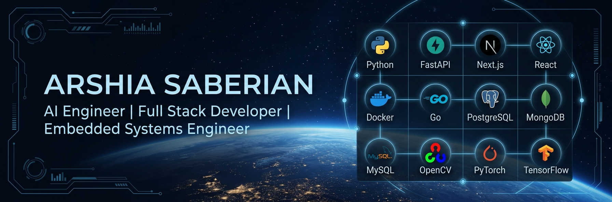

# Hi 👋 I'm Arshia Saberian

> AI & Software Engineer • Machine Learning Engineer • Full Stack Developer • Embedded Systems Developer

---

# About Me

I build production-ready AI systems, full-stack platforms, computer vision applications, NLP pipelines, embedded systems, and cloud deployments.

## Expertise

- 🤖 Artificial Intelligence
- 🧠 Deep Learning
- 💬 Natural Language Processing
- 👁 Computer Vision
- 🌐 Full Stack Development
- ⚡ FastAPI & Next.js
- 🐳 Docker & Linux
- ☁ VPS Deployment
- 🔌 Embedded Systems

---

# Tech Stack

### Languages

Python • Go • JavaScript • C • C++ • SQL • Bash

### AI

PyTorch • TensorFlow • Transformers • YOLO • NumPy • Pandas • Scikit-learn

### Backend

FastAPI • Flask • Node.js

### Frontend

React • Next.js • TailwindCSS • Framer Motion

### Databases

PostgreSQL • MySQL • MongoDB • SQLite

### DevOps

Docker • Linux • Nginx • GitHub Actions • CI/CD

---

# Featured Projects

## TextForge / Rexa
Production-grade Python text processing toolkit.

- Validation
- Extraction
- Normalization
- NLP
- Persian Processing

## AI Projects

- PDF Viewer Pro
- PCB Detection using YOLO
- Translator Application
- N-Gram Text Generator

## Production Platforms

- AIB College
- Chasbine Bot
- Hagg Ecosystem
- Ordibehesht Academy
- Hagg AI
- 3D Landing Experience

---

# Certifications

- Advanced Python
- Machine Learning
- NLP
- Prompt Engineering
- AI Project Management
- Design Patterns
- LLM Development

---

# GitHub Activity

This profile includes:

- ✅ GitHub Metrics Dashboard
- ✅ 3D Contribution Graph
- ✅ GitHub Actions Automation
- ✅ Snake Contribution Animation
- ✅ Automated Profile Workflows

---

# Connect

- GitHub: https://github.com/arshia82sbn
- LinkedIn: https://linkedin.com/in/arshia-saberian-420709177
- Email: arshia82sbn@gmail.com

---

> Building intelligent software that bridges Artificial Intelligence, scalable backend systems, modern web technologies, and embedded devices.
