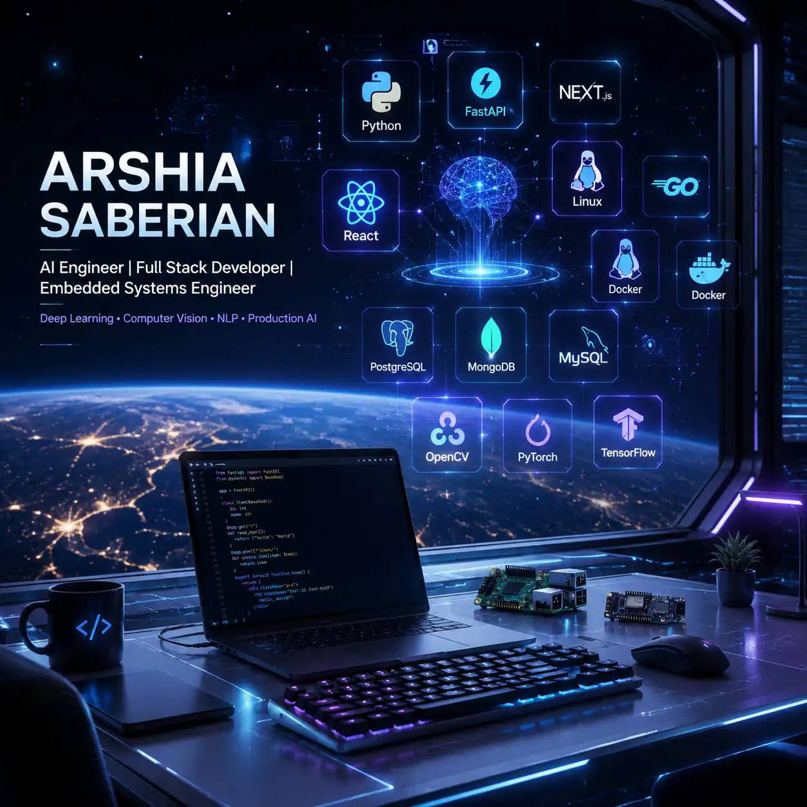
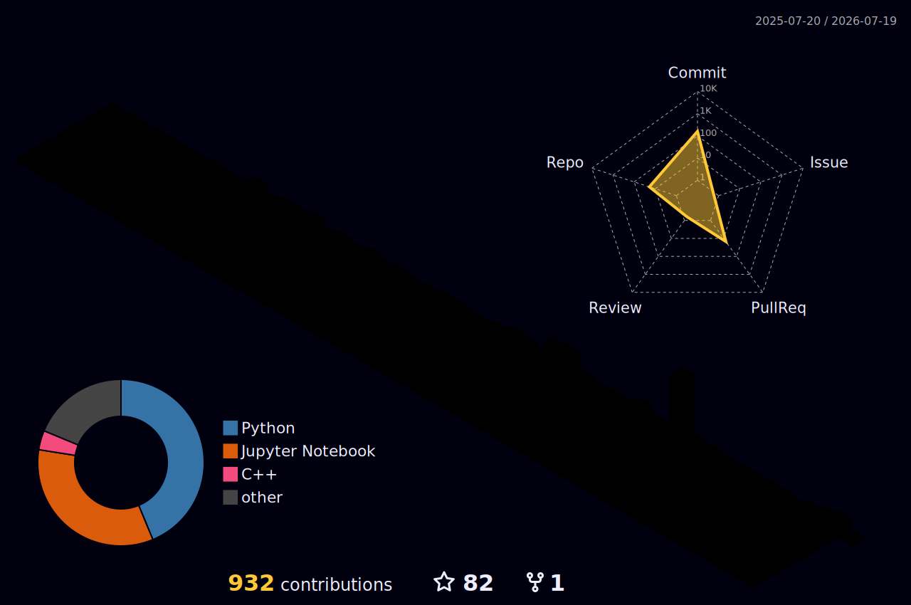

<p align="center">
    
</p>

<h1 align="center">
  Hi 👋 I'm Arshia Saberian
</h1>

<h3 align="center">
AI Engineer • Machine Learning Engineer • Full Stack Developer • Embedded Systems Developer
</h3>

<h4 align="center">
Building Intelligent Software Systems with Artificial Intelligence, Modern Web Technologies and Embedded Computing
</h4>

<p align="center">


</p>

---

<p align="center">

<a href="https://github.com/arshia82sbn">

</a>

<a href="https://pypi.org/project/rexa/">

</a>

<a href="https://pypi.org/project/rexa/">

</a>

</p>

---
# 🧠 About Me

```python
from typing import Dict, List

class ArshiaSaberian:
    """
    AI & Software Engineer specializing in building intelligent applications 
    by combining Artificial Intelligence, Modern Web Technologies, and Embedded Systems.
    """
    
    def __init__(self):
        self.name: str = "Arshia Saberian"
        self.location: str = "Tehran, Iran"
        self.roles: List[str] = [
            "AI & Machine Learning Engineer",
            "Full Stack Developer",
            "Embedded Systems Developer"
        ]
        
        # Categorized based on production experience
        self.tech_stack: Dict[str, List[str]] = {
            "languages": ["Python", "JavaScript", "Go", "C++", "C", "Bash", "SQL"],
            "ai_and_data": ["PyTorch", "TensorFlow", "NLP", "Computer Vision", "LLMs", "YOLO", "Scikit-learn"],
            "backend": ["FastAPI", "Flask", "Node.js", "PostgreSQL", "MongoDB", "MySQL"],
            "frontend": ["Next.js", "React.js", "Tailwind CSS", "Framer Motion"],
            "devops": ["Docker", "Nginx", "Linux", "GitHub Actions", "CI/CD"],
            "embedded": ["ESP32", "Arduino", "Raspberry Pi", "AVR Microcontrollers"]
        }

        self.production_platforms: List[str] = [
            "ordibehesht.tech",   # Programming education platform
            "hagg.info",          # Selling & servicing ecosystem
            "ai.hagg.info",       # AI mushroom intelligence platform
            "aibcollege.ir",      # AI & technology education
            "chasbine-bot.com"    # AI-powered chatbot platform
        ]

    def get_open_source_projects(self) -> Dict[str, str]:
        """Highlights published libraries and major AI repositories."""
        return {
            "Rexa": "Custom Python Regex & Text Processing Library (Published on PyPI)",
            "PDF Viewer Pro": "Professional PDF app with AI-powered summarization",
            "Detecting PCB": "YOLO-based computer vision for PCB components",
            "N-Gram Generator": "NLP modeling with perplexity evaluation and OOV handling"
        }

    def architect_solution(self, domain: str) -> str:
        """Simulates how I architect production-ready systems."""
        stack = "Docker 🐳 -> Nginx 🛡️ -> FastAPI (AI) ⚡ -> Next.js ⚛️"
        return f"[SYSTEM DESIGN] Deploying {domain} solution using: {stack}"

    def collaborate(self) -> str:
        return "Always open to collaboration on AI, scalable software, and web projects! 🚀"

    def __repr__(self) -> str:
        return f"<{self.__class__.__name__} | {self.name} - Building Intelligent Applications>"


if __name__ == "__main__":
    me = ArshiaSaberian()
    print(me)
    print(me.architect_solution("NLP Summarization"))
    # Let's build something awesome. Email: arshia82sbn@gmail.com
```

---

## 🚀 About Me

I am an **AI Engineer and Full Stack Developer** passionate about building intelligent software systems that combine **Artificial Intelligence**, **Modern Web Development**, and **Embedded Computing** into scalable, production-ready solutions.

My work spans the complete software lifecycle—from researching machine learning models and designing backend architectures to building modern frontend applications and deploying production systems.

I enjoy transforming ideas into real-world products, contributing to open source, and continuously exploring emerging technologies in AI and software engineering.

I believe great software is built by combining clean architecture, continuous learning, and practical problem solving.

## 💡 Current Focus

- 🚀 Developing production-ready AI platforms
- 📦 Expanding **Rexa** into a comprehensive AI-powered text processing toolkit
- 🧠 Exploring advanced NLP and LLM applications
- ⚡ Designing scalable FastAPI and Next.js architectures
- 🔬 Learning modern AI model optimization techniques

# 🏗️ Engineering Principles

- Clean, maintainable and scalable architecture
- Performance-oriented backend development
- AI-first software engineering
- Production-ready deployment practices
- User-centered interface design
- Continuous learning and experimentation

My main focus is designing and developing:

- 🤖 Machine Learning & Deep Learning systems
- 🧠 NLP and Computer Vision applications
- 🌐 Full Stack web applications
- ⚡ AI-powered software solutions
- 🔌 Embedded and edge computing systems

I have strong experience developing applications with **Python, FastAPI, Next.js, React, and AI frameworks**, from research prototypes to production-ready systems.

- 🌍 Based in Tehran, Iran
- 💼 Open to collaboration on AI, software, and web projects
- 📚 Continuously exploring advanced AI architectures, system design, and scalable applications


---

# 🛠️ Tech Stack


## 👨‍💻 Programming Languages

<p>


</p>


## 🌐 Frontend Development

<p>


</p>

- React.js
- Next.js
- Tailwind CSS
- Framer Motion
- Modern responsive UI/UX development


## ⚙️ Backend Development

<p>


</p>

- FastAPI
- Flask
- Node.js
- REST API development
- Backend architecture design


## 🗄️ Databases

<p>


</p>

- MySQL
- PostgreSQL
- MongoDB
- SQLite


## 🤖 Artificial Intelligence & Data Science

<p>


</p>


- Machine Learning
- Deep Learning
- Natural Language Processing (NLP)
- Computer Vision
- Transformers
- Large Language Models (LLMs)
- Data Analysis
- NumPy
- Pandas
- Scikit-learn
- YOLO


## 🔌 Embedded Systems

<p>


</p>


- AVR Microcontrollers
- Arduino
- ESP32
- Raspberry Pi
- CodeVision C
- Circuit Design
- Proteus


## 🚀 DevOps & Tools

<p>


</p>


- Linux Administration
- Docker
- Nginx
- VPS Deployment
- GitHub Actions
- CI/CD


---

# 💼 Professional Experience

Over the past few years, I have designed and developed AI systems, desktop applications, web platforms, embedded solutions, and production-ready software for companies, educational institutions, and private clients.

My experience covers the complete development lifecycle—from planning and architecture to implementation, deployment, and long-term maintenance.

---

# 🌐 Production Websites & Client Projects

I have designed and developed multiple production websites and digital platforms for companies and clients.


### 🏢 AI College
🔗 https://aibcollege.ir

Educational platform focused on AI and technology.


### 🤖 Chasbine Bot
🔗 https://chasbine-bot.com

AI-powered chatbot platform.


### 🍄 Hagg Ecosystem
🔗 https://hagg.info

Complete selling and servicing ecosystem.


### 🎓 Ordibehesht Academy
🔗 https://ordibehesht.tech

Programming education platform.


### 🤖 Hagg AI Platform
🔗 https://ai.hagg.info

AI system focused on mushroom intelligence and analysis.


### 🌌 3D Cosmos Landing Experience
🔗 https://landing.hagg.info

Interactive 3D cosmic landing page experience.


---

# 📦 Open Source Projects


## 🔥 Rexa - Python Regex & Text Processing Library

⭐ My own Python library published on PyPI.

GitHub:
https://github.com/arshia82sbn/rexa

PyPI:
https://pypi.org/project/rexa/


### 🚀 Future Roadmap

- Advanced NLP toolkit
- AI-powered text preprocessing
- Language detection
- Named Entity Recognition
- Text embeddings
- Semantic similarity
- Intelligent document processing
- Extensive automated testing
- Interactive documentation

---

# 🧠 Artificial Intelligence Projects


## 📄 PDF Viewer Pro

A professional PDF application with AI-powered summarization.

Features:

- PDF reading system
- AI summarization model integration
- Modern desktop interface


Repository:

https://github.com/arshia82sbn/PDF_Viewer_Pro


---

## 👁️ Detecting PCB Objects Using YOLO

Computer vision project for detecting PCB components using YOLO models.

Repository:

https://github.com/arshia82sbn/Detecting_PCB_Object_by_YOLO


---

## 🌍 Translator Application

AI-powered translation application.

Technologies:

- NLP
- Translation models
- Python


Repository:

https://github.com/arshia82sbn/Translator_App


---

## ✍️ Text Generator With N-Gram Model

Natural Language Processing project implementing:

- N-Gram language modeling
- Text generation
- Perplexity evaluation
- OOV handling


Repository:

https://github.com/arshia82sbn/Text_Generator_With_N-Grams_Model


---

# 📊 Data Science Projects


## 🍫 Chocolate Company Analysis

Data analysis project using:

- NumPy
- Pandas
- Data visualization
- Business analysis


Repository:

https://github.com/arshia82sbn/Chocolote_Company_Analyze


---

## 🌸 Iris Flower Classification With NumPy

Machine learning implementation using mathematical foundations.

Repository:

https://github.com/arshia82sbn/Iris_flower_with_numpy


---

## ⚙️ Technologies Used Across Production Projects

- Next.js
- React
- FastAPI
- Flask
- PostgreSQL
- MySQL
- Docker
- Linux VPS
- Nginx
- GitHub Actions
- REST APIs
- SEO Optimization

---

# 🎓 Certifications & Learning


## AI & Programming

- Data Science -FreeCodeCamp
- python -Simplilearn
- Advanced Python — Sematec
- Python Programming — Sematec
- Prompt Engineering — MTF Institute Portugal
- AI Project Management — Udemy
- NLP — Quera
- Design Pattern — Quera
- Python — Kaggle
- Machine Learning — Kaggle
- LLM Application Development — Quera


---

# 📊 GitHub Dashboard

<p align="center">


</p>

<p align="center">

</p>


---

# 🐍 Contribution Graph

<p align="center">

</p>

---

# 🏙️ 3D Contribution Map

<p align="center">

</p>

---

<p align="center">


</p>

---

# 📫 Connect With Me


<p align="center">

<a href="mailto:arshia82sbn@gmail.com">

</a>


<a href="https://github.com/arshia82sbn">

</a>


<a href="https://www.linkedin.com/in/arshia-saberian-420709177">

</a>

</p>

---


<p align="center">

⭐ Turning ideas into intelligent, scalable and production-ready software.

</p>
